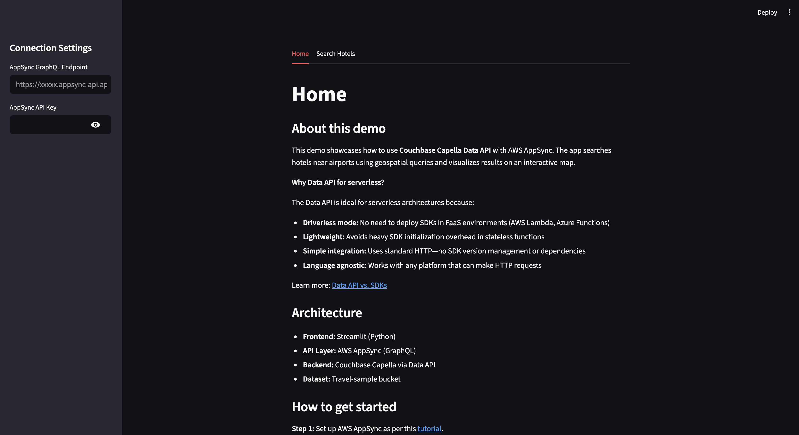
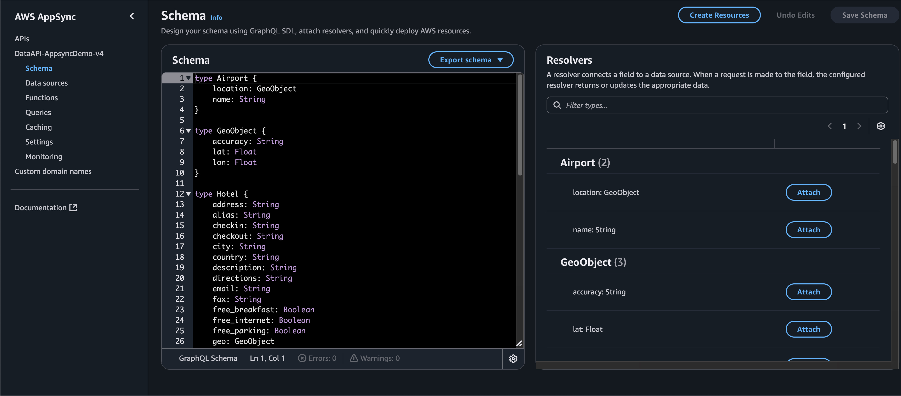

# Travel Sample: AppSync + Couchbase Data API

## Motivation

This demo showcases how to use **Couchbase Capella Data API** in a serverless architecture. The app connects AWS AppSync with Couchbase Capella using the Data API—ideal for serverless environments because it:

- **Enables driverless mode:** No need to deploy SDKs in FaaS environments (AWS Lambda, Azure Functions)
- **Is lightweight:** Avoids heavy SDK initialization overhead in stateless functions
- **Simplifies integration:** Uses standard HTTP—no SDK version management or dependencies
- **Is language agnostic:** Works with any platform that can make HTTP requests

Learn more: [Data API vs. SDKs](https://docs.couchbase.com/cloud/data-api-guide/data-api-sdks.html)

**Architecture Overview:**
- **Frontend:** Streamlit (Python) for interactive UI
- **API Layer:** AWS AppSync (GraphQL) as the API source
- **Backend:** Couchbase Capella connected via Data API
- **Use Case:** Search hotels near airports using geospatial queries

The query uses geospatial calculations to find hotels within a specified distance from an airport and visualizes results on an interactive map.

## Screenshots

- Streamlit frontend
  - Home Page
    
  
  - Map visualization  
    

## What's here
- `src/backend/`
  - `schema.graphql`: Defines the GraphQL schema with:
    - Query: `listHotelsNearAirport(airportName: String!, withinKm: Int!)`
    - Returns `Output` type with `hotels: [Hotel]` and `airport: Airport`
    - `Airport` type includes `name: String` and `location: GeoObject` (lat, lon, accuracy)
    - `Hotel` type includes all hotel details, geo location, and reviews
  - `listHotelsInCity resolver.js`: JavaScript resolver for AppSync HTTP data source
    - Calls Couchbase Data API to query `travel-sample.inventory.hotel` and `travel-sample.inventory.airport`
    - Uses a SQL++ query with Common Table Expression (CTE) for geospatial distance calculation
    - Extracts airport coordinates from query results and combines with airport name from input
    - Returns structured response matching the `Output` schema
    - Credentials read from AppSync environment variables (`cb_username`, `cb_password`)
  - `query.graphql`: Example GraphQL query for testing in the AppSync console
- `src/frontend/`
  - `home.py`: Streamlit main entry point with tab-based navigation and connection settings (GraphQL endpoint, API key)
  - `search_hotels.py`: Interactive search interface
    - Calls AppSync GraphQL API with airport name and distance parameters
    - Displays results on an interactive map using Pydeck
    - Hotels shown as color-coded markers (red to green by rating)
    - Airport shown as orange marker with white outline
    - Hover tooltips show hotel details (name, rating, address, price, etc.) or just airport name
    - Automatically centers and zooms map to show all markers

## Prerequisites

Before you get started, make sure you have:

1. **[Couchbase Capella account](https://cloud.couchbase.com/sign-up)** with a [running cluster](https://docs.couchbase.com/cloud/get-started/create-account.html)
2. **[Travel-sample bucket](https://docs.couchbase.com/cloud/clusters/data-service/import-data-documents.html)** imported into your cluster
3. **[Data API enabled](https://docs.couchbase.com/cloud/data-api-guide/data-api-start.html)** in Capella (via the cluster's Connect page)
4. **[AWS account](https://aws.amazon.com/)** with permissions to create AppSync APIs

## Quick Start

> **For a detailed step-by-step tutorial, see:** [Build a Hotel Search App with AppSync, Data API, and Streamlit](https://developer.couchbase.com/tutorial-appsync-data-api-streamlit-travel-sample)

### 1. Set Up AWS AppSync

**a) Create AppSync API:**
- Go to AWS AppSync console
- Create a new API (choose "Build from scratch" option)
- Name your API (e.g., "HotelSearchAPI")

**b) Create HTTP Data Source:**
- Go to Data sources → Create data source
- Data source type: **HTTP**
- Name: `CouchbaseDataAPI`
- HTTP endpoint URL: Your Couchbase Data API base URL
- **Note:** Do NOT enable "Authorization" configuration—credentials will be passed via resolver


**c) Configure Environment Variables:**
- Go to Settings → Environment variables
- Add:
  - `cb_username`: Your Couchbase Data API username
  - `cb_password`: Your Couchbase Data API password


**d) Import Schema:**
- Go to Schema
- Copy contents from `src/backend/schema.graphql` and paste into the schema editor
- Save schema



**e) Create Resolver:**
- Go to Schema → Query type → `listHotelsNearAirport` field
- Click "Attach Resolver"
- Data source: Select `CouchbaseDataAPI`
- Runtime: **JavaScript**
- Copy contents from `src/backend/listHotelsInCity resolver.js` and paste into resolver code editor
- Save resolver


**f) Test Your Query:**
- Go to Queries
- Copy the query from `src/backend/query.graphql`
- Provide variables: `{"airportName": "London Heathrow", "withinKm": 50}`
- Run query to verify setup

**g) Get API Credentials:**
- Go to Settings to find your **GraphQL endpoint URL**
- Go to API Keys → Create API key and note the **API Key** (starts with `da2-`)

### 2. Set Up Frontend (Streamlit)

Install dependencies and run:
```bash
# Navigate to the project directory
cd couchbase-data_api-appsync-demo

# Create a virtual environment
python3 -m venv .venv

# Activate the virtual environment
source ./.venv/bin/activate

# Install required dependencies
pip install -r requirements.txt

# Run the Streamlit app
streamlit run src/frontend/home.py
```

In the app:
- Enter **AppSync GraphQL Endpoint** and **API Key** in the sidebar (from AppSync Settings)
- Click the **"Search Hotels"** tab
- Try example airports: `San Francisco Intl`, `Les Loges`, `Luton`, `London St Pancras`
- Enter distance in km and click **Search**

## Notes

**Backend (Resolver)**
- Assumes collections `travel-sample.inventory.hotel` and `travel-sample.inventory.airport` exist
- Uses SQL++ query with CTE to find airport coordinates: `SELECT a.geo.lat, a.geo.lon, a.geo.accuracy FROM airport WHERE a.airportname = $1`
- Calculates distance using Pythagorean theorem approximation (accurate for small distances): `POWER(hotel_lat - airport_lat, 2) + POWER(hotel_lon - airport_lon, 2) <= POWER(distance_km / 111, 2)` where 111 ≈ km per degree of latitude
- Returns airport coordinates from first result row (all rows have same airport location)
- Combines airport location with airport name from input arguments to create `Airport` object
- Cleans hotel objects by removing airport coordinate fields (alat, alon, accuracy)

**Frontend (Streamlit)**
- Extracts airport name and location from the `airport` object in GraphQL response
- Computes hotel ratings by averaging `Overall` scores from reviews array, scaled to 0-10
- Colors hotel markers from red (low rating) to green (high rating)
- Shows airport marker in orange with larger size and white outline for visibility
- Tooltips display full details for hotels, only name for airport
- Map auto-centers on all markers with appropriate zoom level based on geographic spread

